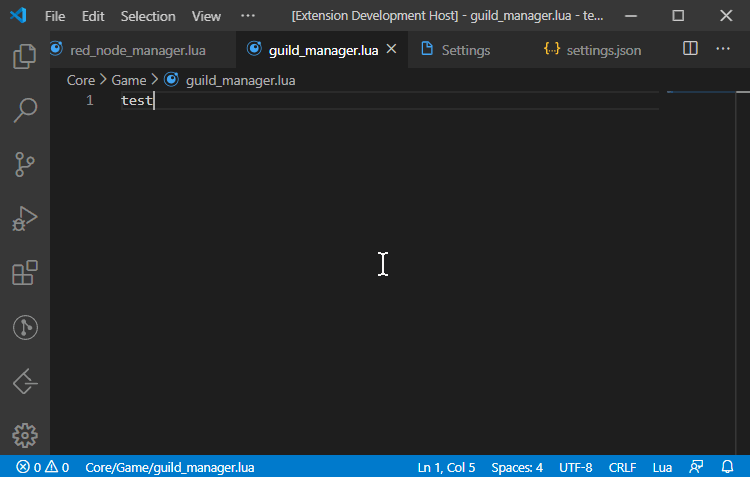
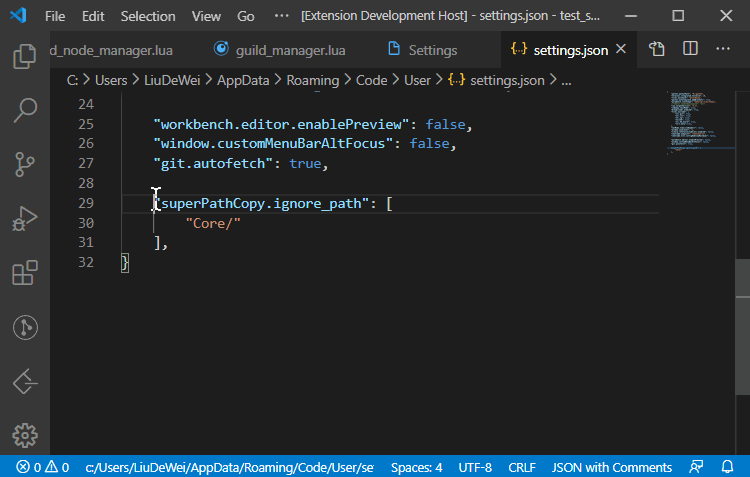
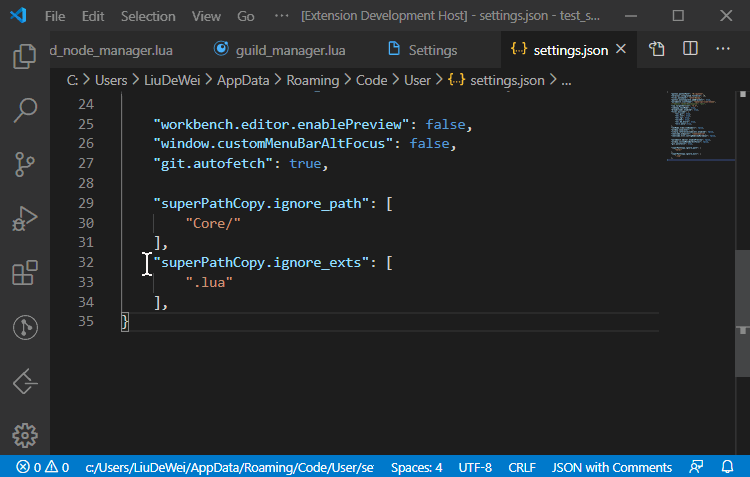
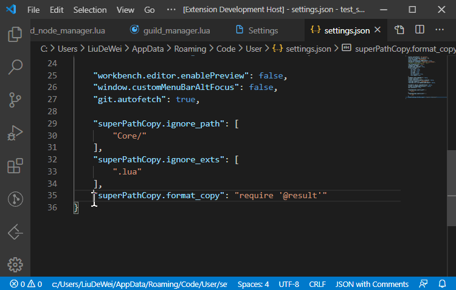

The extension provides a convenient way for path processing.

このプラグインは、ファイルパスの高速処理ショートカットを提供します。

该插件提供对文件路径的快速处理快捷方式。

- Click the bottom status bar to quickly copy the relative path of the open file.

- Ignore unnecessary parts by configuring the `superPathCopy.ignore_path`.

- Custom ignore suffix by configuring `superPathCopy.ignore_exts`.

- Control replication results by configuring `superPathCopy.format_copy`.
